[返回主页]()

# 幻兽帕鲁开服教程(腾讯云)
## 1. 服务器配置选择

腾讯云官网活动页面:https://cloud.tencent.com/act/pro/bestselling?from=21723

根据自己的需求选择服务器配置，截止到本教程发布时，幻兽帕鲁开服至少需要16~32G内存的服务器
    
    2-8人服务器，时长1~3个月可以选择 《轻量 4核16G14M》 套餐：93元1个月，227元3个月
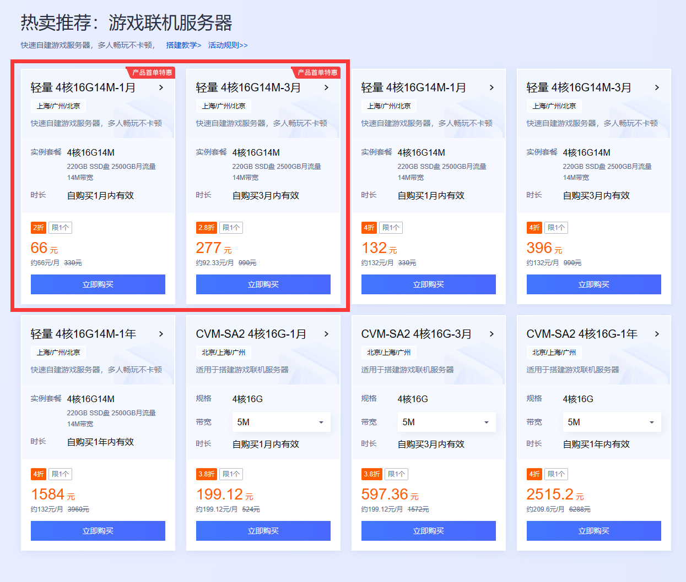

    8-16人服务器，时长1年，推荐16核32G的套餐（需要新用户）

    16-32人服务器，16核32G的服务器也能用，但是推荐更高配置的服务器，目前没有推荐的，因为都很贵，没买过~

## 2. 为服务器重装系统

    首先进入控制台页面，然后选择轻量应用服务器

    选择重装系统
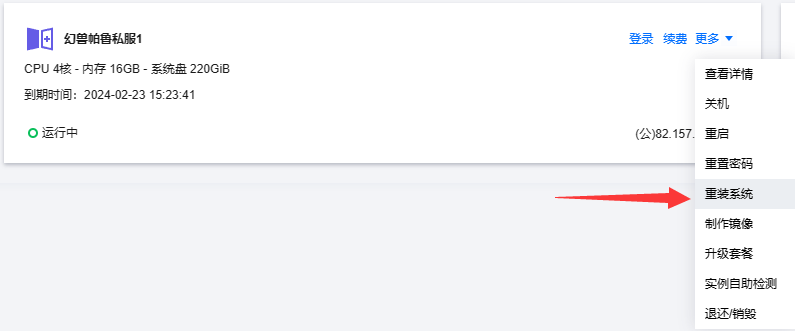

    按以下步骤选择服务器系统，然后等待服务器重装完成
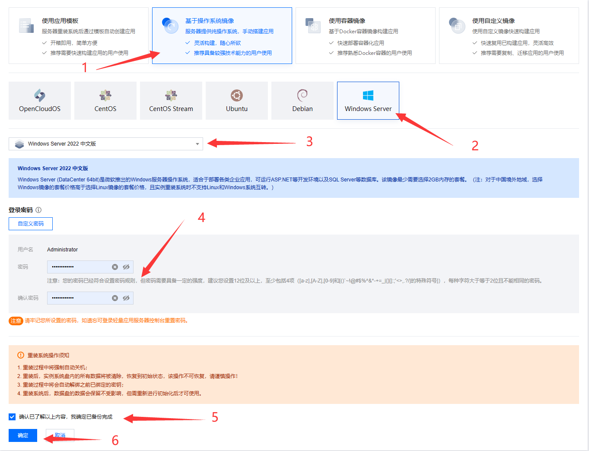

    设置服务器防火墙，通过添加规则按钮，添加UDP协议，端口为8211
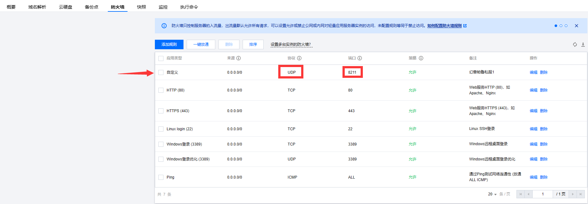

    在网络与域名处找到你的服务器IP，使用用户名Administrator和你重装时设置的密码，通过 远程桌面连接 工具连接至你的服务器

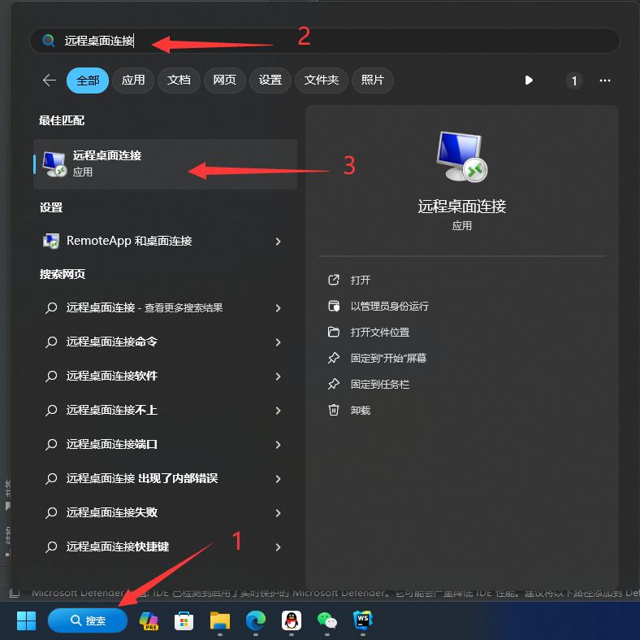

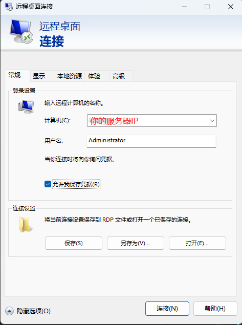

## 3. 安装开服所需的程序

    安装 DirectX End-User Runtime
在此页面下载并安装DirectX End-User Runtime https://www.microsoft.com/zh-cn/download/details.aspx?id=35

    安装 steamcmd
通过此链接下载steamcmd https://steamcdn-a.akamaihd.net/client/installer/steamcmd.zip

    在文件资源管理器中勾选显示文件扩展名

    在桌面新建一个GameServer文件夹
    将steamcmd解压后放入此文件夹，然后新建一个名为update.cmd的文件（新建文本文档，然后重命名为update.cmd）

    右键选择编辑update.cmd,填入以下内容 steamcmd +login anonymous +app_update 2394010 validate +quit
    然后保存并关闭
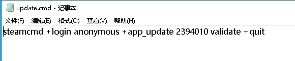

    双击运行update.cmd，此时将自动更新steamcmd和游戏服务器文件，等待此程序自动关闭即可
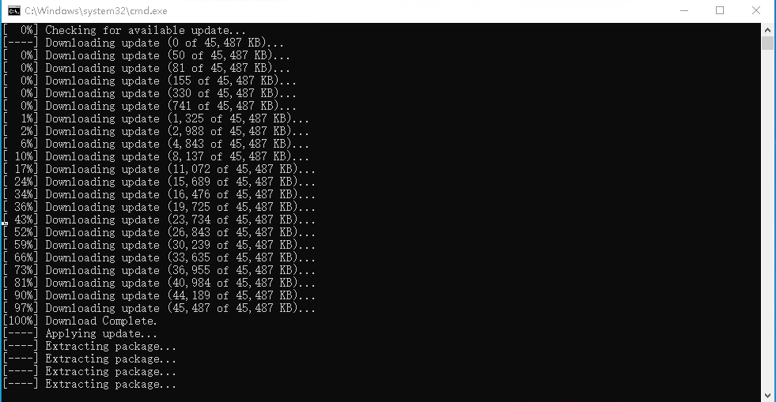

    等待更新完成后，进入GameServer\steamapps\common\Steamworks Shared\_CommonRedist\vcredist\2022，安装所需的环境
    双击此文件会自动安装，无需任何操作
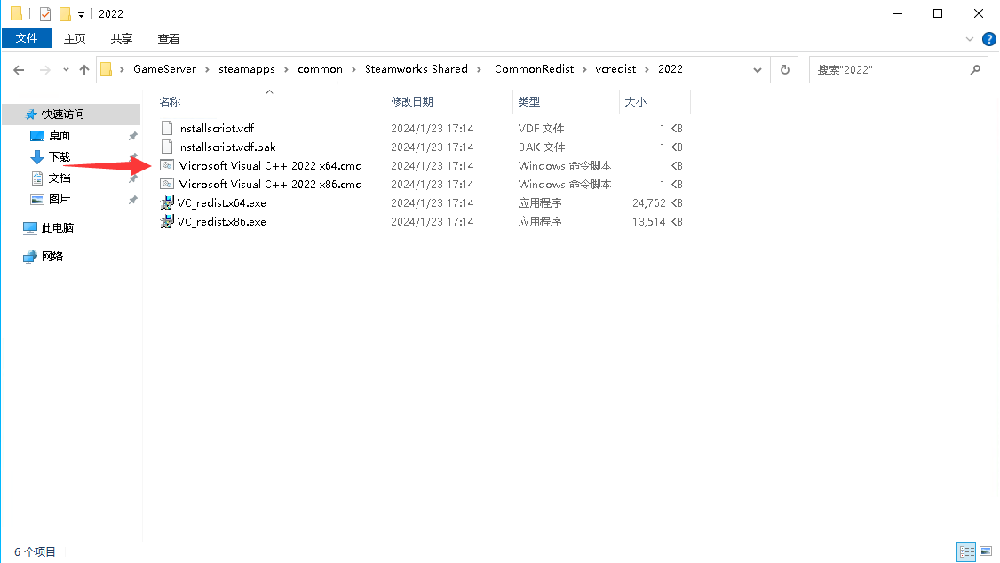

    然后进入GameServer\steamapps\common\PalServer，选择服务器文件，双击运行，服务器窗口打开即可，不用关心里面有没有内容
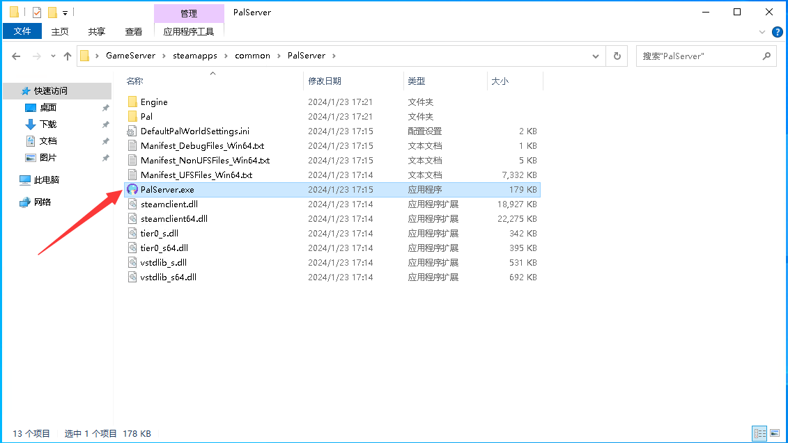

    至此，你的服务器已经创建完毕，现在就可以通过 你的服务器IP:8211 进入到此游戏服务器中

## 4. 服务器性能优化

1.官方文档中提到可以通过`-useperfthreads -NoAsyncLoadingThread -UseMultithreadForDS`让服务器使用多核
    步骤如下：

    将服务器程序发送到桌面快捷方式
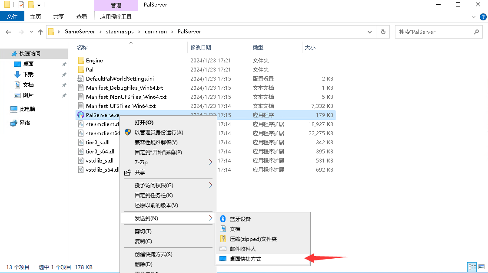

    右键桌面的快捷方式，选择属性
    在目标后面加入-useperfthreads -NoAsyncLoadingThread -UseMultithreadForDS
    如下：
    C:\Users\Administrator\Desktop\GameServer\steamapps\common\PalServer\PalServer.exe -useperfthreads -NoAsyncLoadingThread -UseMultithreadForDS
    此后通过此快捷方式启动游戏服务器即可
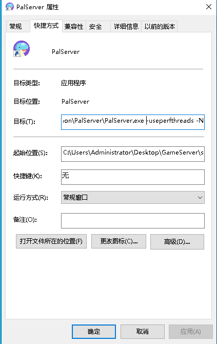

2.服务器最佳性能模式

    在服务器开始按钮旁边的搜索栏内搜索 高级系统 可以打开服务器的高级系统设置
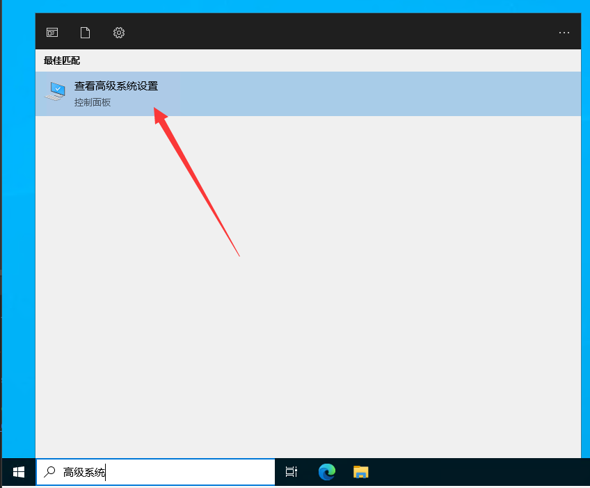

    将服务器调整为最佳性能模式
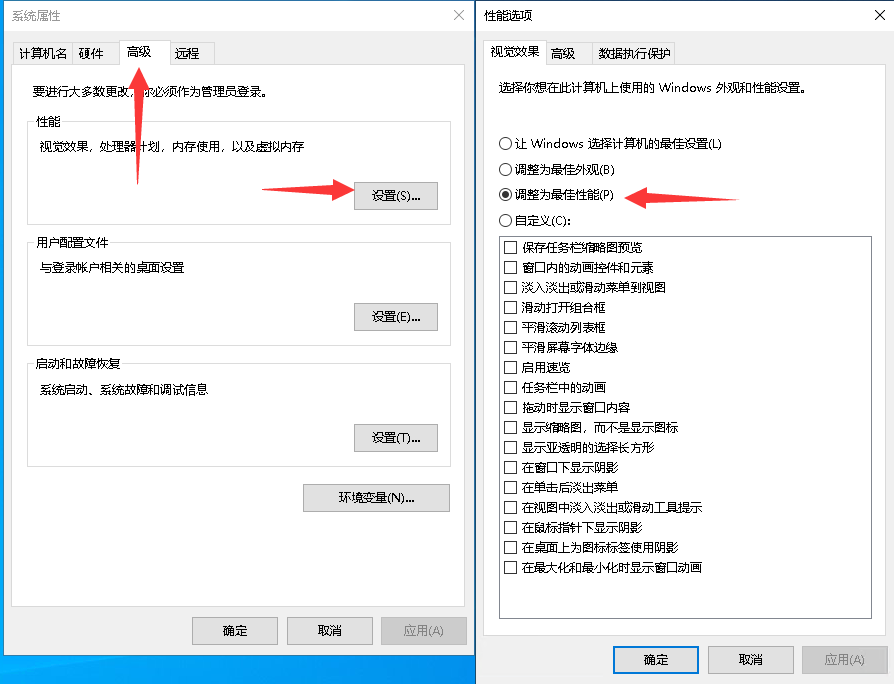

    调整服务器的虚拟内存，保存后重启服务器
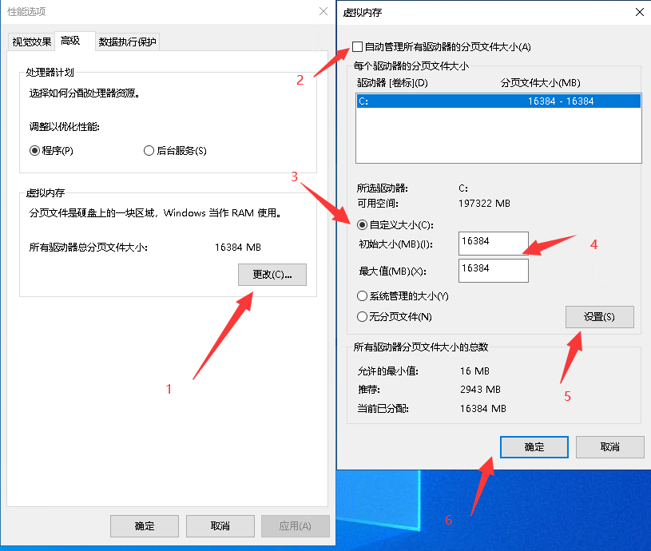

## 5. 游戏服务器的配置文件

    在启动一次服务器后，会在GameServer\steamapps\common\PalServer\Pal\Saved\Config\WindowsServer
    目录下生成游戏的配置文件
    需要修改的文件名为：PalWorldSettings.ini
    此文件打开后为空内容，复制以下内容进去保存即可
    
    ; This configuration file is a sample of the default server settings.
    ; Changes to this file will NOT be reflected on the server.
    ; To change the server settings, modify Pal/Saved/Config/WindowsServer/PalWorldSettings.ini.
    [/Script/Pal.PalGameWorldSettings]
    OptionSettings=(Difficulty=None,DayTimeSpeedRate=1.000000,NightTimeSpeedRate=1.000000,ExpRate=3.000000,PalCaptureRate=3.000000,PalSpawnNumRate=1.000000,PalDamageRateAttack=1.000000,PalDamageRateDefense=1.000000,PlayerDamageRateAttack=1.000000,PlayerDamageRateDefense=1.000000,PlayerStomachDecreaceRate=1.000000,PlayerStaminaDecreaceRate=1.000000,PlayerAutoHPRegeneRate=1.000000,PlayerAutoHpRegeneRateInSleep=1.000000,PalStomachDecreaceRate=1.000000,PalStaminaDecreaceRate=1.000000,PalAutoHPRegeneRate=1.000000,PalAutoHpRegeneRateInSleep=1.000000,BuildObjectDamageRate=1.000000,BuildObjectDeteriorationDamageRate=1.000000,CollectionDropRate=3.000000,CollectionObjectHpRate=3.000000,CollectionObjectRespawnSpeedRate=1.000000,EnemyDropItemRate=3.000000,DeathPenalty=None,bEnablePlayerToPlayerDamage=False,bEnableFriendlyFire=False,bEnableInvaderEnemy=True,bActiveUNKO=False,bEnableAimAssistPad=True,bEnableAimAssistKeyboard=False,DropItemMaxNum=1000,DropItemMaxNum_UNKO=100,BaseCampMaxNum=128,BaseCampWorkerMaxNum=20,DropItemAliveMaxHours=1.000000,bAutoResetGuildNoOnlinePlayers=False,AutoResetGuildTimeNoOnlinePlayers=720.000000,GuildPlayerMaxNum=8,PalEggDefaultHatchingTime=1.000000,WorkSpeedRate=1.000000,bIsMultiplay=False,bIsPvP=False,bCanPickupOtherGuildDeathPenaltyDrop=False,bEnableNonLoginPenalty=True,bEnableFastTravel=True,bIsStartLocationSelectByMap=True,bExistPlayerAfterLogout=False,bEnableDefenseOtherGuildPlayer=False,CoopPlayerMaxNum=4,ServerPlayerMaxNum=8,ServerName="私服",ServerDescription="3倍经验，3倍捕获概率，3倍资源HP，3倍掉落和采集，1小时孵蛋，死亡不掉落",AdminPassword="",ServerPassword="",PublicPort=8211,PublicIP="",RCONEnabled=False,RCONPort=25575,Region="",bUseAuth=True,BanListURL="https://api.palworldgame.com/api/banlist.txt")
    
    如下图所示
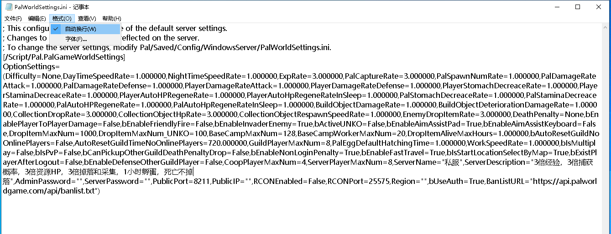

    上面的内容是我常用的预设
    其中：
        ExpRate=3.000000 代表三倍经验
        PalCaptureRate=3.000000 代表3倍捕获概率
        CollectionDropRate=3.000000 代表3倍采集
        CollectionObjectHpRate=3.000000 代表3倍资源血量
        EnemyDropItemRate=3.000000 代表3倍掉落物
        DeathPenalty=None 代表死亡不掉落
        DropItemMaxNum=1000 代表服务器掉落物上限为1000
        PalEggDefaultHatchingTime=1.000000 代表巨大帕鲁蛋孵化所需要的时间
        ServerPlayerMaxNum=8 代表服务器人数上限
        ServerName="" 代表服务器名称
        ServerDescription="" 代表服务器描述